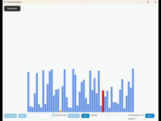
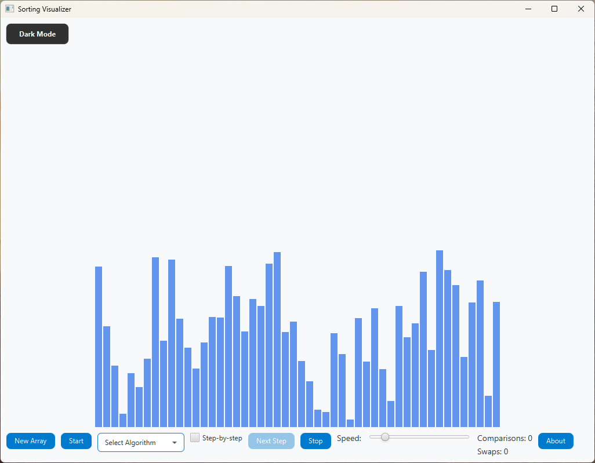
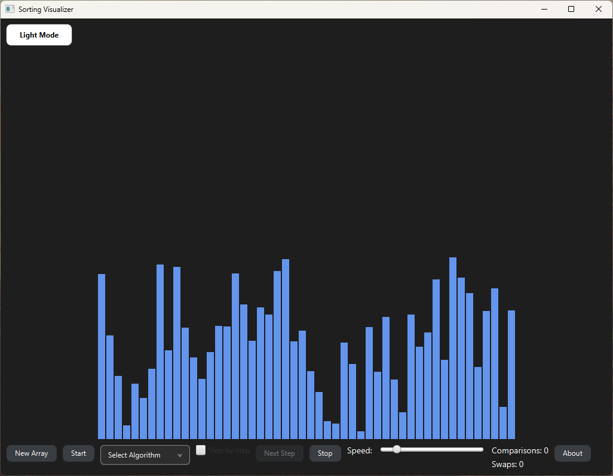
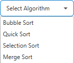

# Sorting Visualizer in JavaFX

A dynamic sorting algorithm visualizer built with JavaFX.  
This project helps students and developers understand how different sorting algorithms work by displaying step-by-step animations of the sorting process.

---

## 🚀 Features

- Real-time visualization of multiple sorting algorithms
- Step-by-step execution and pause support
- Adjustable animation speed with a slider
- Interactive controls: generate new array, select algorithm, start animation
- Real-time counters for comparisons and swaps
- Automatic disabling of controls during sorting
- Clean and responsive UI built with JavaFX
- About dialog and dark/light theme support

---

## 📚 Algorithms Implemented

| Algorithm      | Status     |
|----------------|------------|
| Bubble Sort    | ✅ Done     |
| Selection Sort | ✅ Done     |
| Insertion Sort | ⏳ Planned  |
| Merge Sort     | ✅ Done     |
| Quick Sort     | ✅ Done     |
| Heap Sort      | 🟡 Optional |

---

## 🛠️ Technologies

- Java 17+
- JavaFX 21+
- Maven

---

## ▶️ How to Run

Make sure you have:

- Java 17+ installed and configured as `JAVA_HOME`
- Maven installed (v3.6 or higher)

Then run the app with:

```bash
mvn clean javafx:run
````

---

## 📦 Project Structure

```bash
src/
├── app/
│   ├── algorithms/   # Sorting algorithm implementations
│   ├── controller/   # UI event handling and state
│   ├── view/         # JavaFX layout and visual logic
│   └── Main.java     # Application entry point
```

---

## 📸 Preview

### 🔁 Bubble Sort Animation



### 💡 Light Mode



### 🌙 Dark Mode



### 🧮 Algorithms



---

## 🧑‍💻 Author

Built with ❤️ by a Computer Engineering student passionate about algorithms, data structures, and clean code.

---

## 🤝 Contributing

Interested in improving the project?
Check out the [CONTRIBUTING.md](CONTRIBUTING.md) guide to get started.

---

## 📄 License

This project is licensed under the [MIT License](LICENSE).
