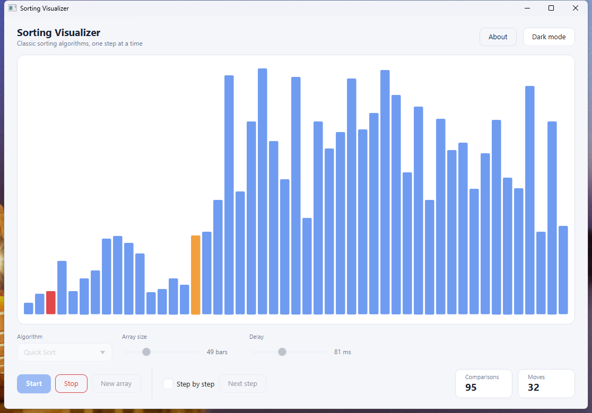
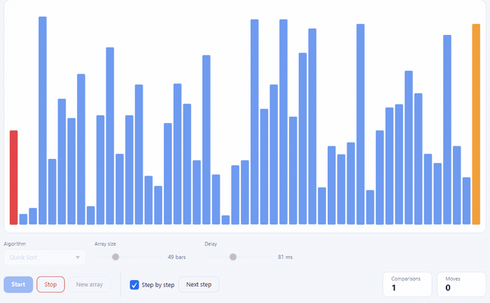
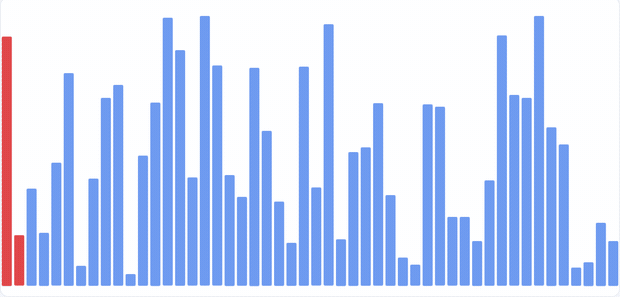
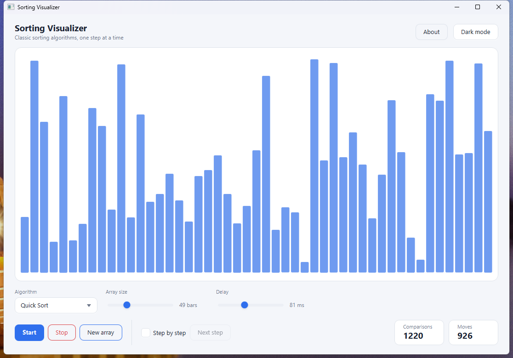
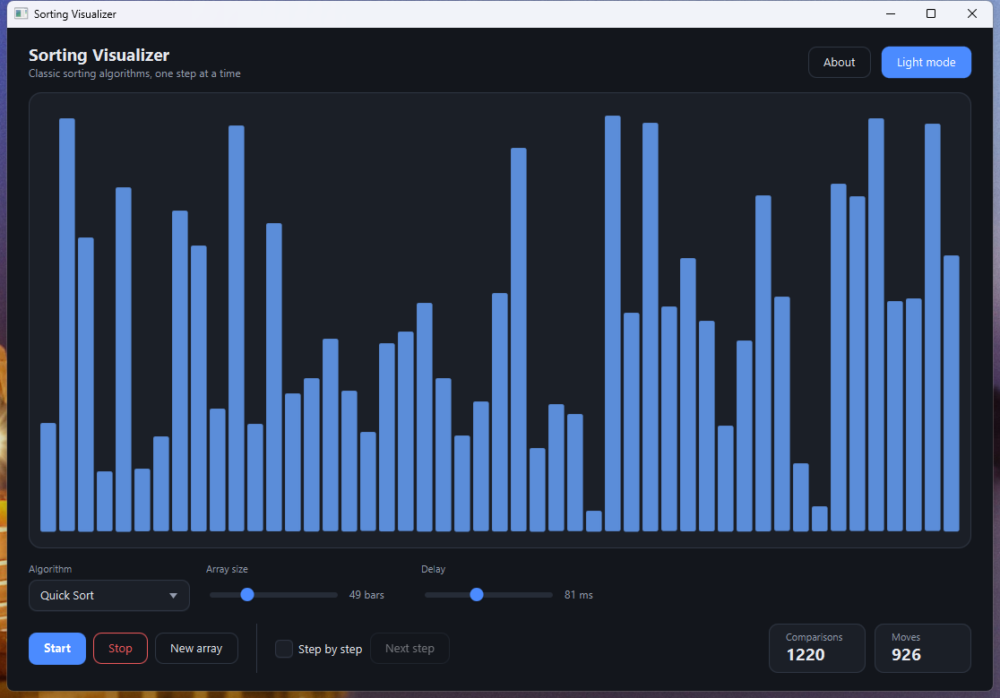
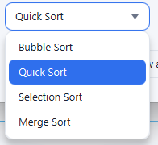

<div align="center">

# Sorting Visualizer

**Watch classic sorting algorithms work, one step at a time.**

A JavaFX desktop app that animates six classic sorting algorithms — with a
step-by-step mode you can drive by hand, live counters, and a light and dark
theme.

[](https://github.com/CristianInBits/sorting-visualizer/actions/workflows/build.yml)
[](https://adoptium.net/)
[](https://openjfx.io/)
[](LICENSE)



</div>

---

## 🚀 Run it

### What you need

**A JDK, version 17 or newer. Nothing else.** Maven ships with the repository
through its wrapper, and JavaFX arrives as an ordinary dependency, so neither
has to be installed by hand.

Check what you already have:

```bash
java -version
```

If that prints something below 17, or does not run at all, grab a JDK from
[Adoptium](https://adoptium.net/) and open a new terminal afterwards so the
change to `PATH` takes effect.

### Start it

```bash
git clone https://github.com/CristianInBits/sorting-visualizer.git
cd sorting-visualizer
./mvnw javafx:run
```

On Windows, use `.\mvnw.cmd javafx:run` instead. The `.\` matters:
PowerShell never looks in the working directory for a command.

Or skip the terminal altogether with the launchers in the repository root:
**`run.bat`** on Windows, **`run.sh`** elsewhere. They check that a JDK is
present, say so plainly if it is not, and otherwise hand straight over to the
wrapper. Double-clicking works on Windows; on Linux and macOS most file
managers open a `.sh` in an editor instead of running it, so there you are
better off with `./run.sh` from a terminal.

The first run fetches Maven and about **30 MB** of dependencies, so give it a
minute. After that it starts in a few seconds. To run the tests instead of the
app, use `./mvnw test`.

### If it does not start

| What you see | What it means |
|---|---|
| `java: command not found`, or `JAVA_HOME is not defined correctly` | No JDK on the `PATH`. Install one and reopen the terminal |
| `invalid target release: 17`, or a `class file version` complaint | The JDK being used is older than 17. `java -version` says which one |
| `./mvnw: Permission denied` | The execute bit was lost, usually by downloading the ZIP rather than cloning. `chmod +x mvnw` |
| `bad interpreter: /bin/sh^M` | `mvnw` picked up Windows line endings. Clone again — the repository pins it to LF through `.gitattributes` |
| It sits on `Downloading from central` | A proxy or firewall is blocking `repo.maven.apache.org`. Maven reads proxy settings from `~/.m2/settings.xml` |
| `no main manifest attribute` | You ran `java -jar target/…jar`. That jar is not self-contained; use `./mvnw javafx:run` |

---

## ✨ What you can do

- **Step through it by hand.** Tick *Step by step* and the run pauses on every
  comparison and every move. Untick it mid-run and it carries on from where it
  paused.
- **Watch the cost add up.** Comparisons and moves are counted live, and they
  stay on screen when the run ends so you can actually read them.
- **Choose how much there is to sort.** Anywhere from 10 to 150 bars. They
  are redrawn to fit, and the gap between them shrinks along with them.
- **Set the pace.** A delay of 1 to 200 ms per frame, with a live readout.
- **Stop whenever.** The array is always left consistent, never half-copied.
- **Switch themes.** Light and dark, bars included.
- **Resize freely.** The bars fill the window and follow it.

<br>

<div align="center">

<br>
<em>Step-by-step mode — one click, one step.</em>
</div>

---

## 📊 The algorithms

<div align="center">

<br>
<em>Bubble Sort — the largest value bubbles to the end on every pass.</em>
</div>

<br>

| Algorithm | Comparisons | Moves | Extra memory | Stable |
|---|---|---|---|---|
| **Bubble Sort** | O(n²) | O(n²) | O(1) | Yes |
| **Insertion Sort** | O(n²), O(n) on sorted input | O(n²) | O(1) | Yes |
| **Selection Sort** | O(n²) | O(n) | O(1) | No |
| **Merge Sort** | O(n log n) | O(n log n) | O(n) | Yes |
| **Quick Sort** | O(n log n) avg, O(n²) worst | O(n log n) avg | O(log n) | No |
| **Heap Sort** | O(n log n) | O(n log n) | O(1) | No |

> **Bubble Sort** is the plain version without the early-exit flag, so it always
> performs the full n(n − 1)/2 comparisons even on an already sorted array.
> **Insertion Sort** does stop early, which is why it needs about half the
> comparisons for the same number of moves.
> **Quick Sort** partitions with Lomuto on the last element, so sorted input is
> its worst case.
> **Insertion Sort** is written with exchanges rather than shifts: shifting
> leaves a hole in the array, and the animation would be drawing a state that
> is briefly missing an element.

### What the app actually measures

Averages over 500 random arrays of 50 elements, the same arrays for every
algorithm, measured by running the real classes through the trace the tests
use — not a separate model of them:

| Algorithm | Comparisons | Moves |
|---|---:|---:|
| Bubble Sort | 1225 | 1219 |
| Insertion Sort | 655 | 1219 |
| Selection Sort | 1225 | **91** |
| Merge Sort | **222** | 221 |
| Quick Sort | 262 | 215 |
| Heap Sort | 415 | 483 |

A **move** is an array write that actually changes a value — that is, a bar that
changes height. A swap of two different values counts as 2, one merge copy
counts as 1.

Counting moves rather than swaps is what makes them comparable: Merge Sort
performs no swaps at all, it copies through a buffer, so a swap counter made it
look like it shuffled more data than Quick Sort when it does not.

Two things the table shows nicely: Insertion Sort moves exactly as much data as
Bubble Sort but asks **half the questions**, and Selection Sort barely moves
anything — it is the one that minimises writes, at the cost of always making
every comparison.

---

## 🌗 Themes

<div align="center">
<table>
<tr>
<td align="center"><strong>Light</strong></td>
<td align="center"><strong>Dark</strong></td>
</tr>
<tr>
<td></td>
<td></td>
</tr>
</table>
</div>

Bar colours live in the stylesheets, not in the Java code, so they follow the
theme along with everything else.

---

## 🧩 How it works

The algorithms are plain Java. They know nothing about JavaFX, threads or
timing: each one sorts an `int[]` and reports what it did to a `SortTrace`.

```
BubbleSort · InsertionSort · SelectionSort · MergeSort · QuickSort · HeapSort
                     sort(int[] values, SortTrace trace)
                                      │
                      ┌───────────────┴────────────────┐
                      ▼                                ▼
                AnimatedTrace                   RecordingTrace
         bars, colours, delay, stop        counts, replays, asserts
              (the running app)                   (the tests)
```

Two consequences worth having:

- **The algorithms are testable** without starting a window. The whole suite
  runs in about a second.
- **The narration is verified, not assumed.** Every test run is rebuilt from the
  reported steps alone and has to reproduce the sorted array, so an algorithm
  cannot quietly disagree with what the animation draws.

Stopping is an exception thrown by the trace, so an algorithm needs no
`isStopRequested()` checks scattered through its loops — it just lets the
exception unwind.

---

## 🧪 Tests

```bash
./mvnw test
```

50 tests, about three seconds, no display needed:

- Each algorithm against 200 random arrays, plus the edge cases — empty, one
  element, all equal, already sorted, reversed, duplicates, extreme values.
- Each one **stopped at every single step** of a run, checking the array is
  never left with values lost or invented.
- The step-by-step gate, driven by real threads: a Next Step that arrives early
  is not dropped, and unticking the box releases a run that is parked.
- The bars and the control panel, as the real JavaFX nodes. The algorithms
  need no toolkit; these do, and they get a headless one from Monocle, so
  they run on a CI machine with no screen like everything else.
- The application window itself: its layout, and the theme toggle swapping
  palettes both ways without piling up stylesheets. One test reads the
  background JavaFX actually resolved, because loading the right file does
  not by itself prove the colours reached the screen.
- The stylesheets against each other: every colour `base.css` looks up has
  to be defined by both palettes, since a missing one raises no error and
  just leaves part of the window uncoloured.

The interface tests measure **where the bars actually land after a layout
pass**, not what the sizing formula intended. That distinction matters: the
one time the bars spilled out of the panel, the formula was correct and the
layout was not. One of them also presses Start, waits for the worker to
finish, and checks the array came back sorted.

---

## 📁 Project structure

```
src/main/java/app/
├── algorithms/   Plain Java. No JavaFX in here.
│                 Each algorithm sorts an int[] and reports to a SortTrace.
├── player/       AnimatedTrace turns those steps into the animation;
│                 StepGate paces the run. The only JavaFX-aware layer.
├── controller/   Controls, run state, worker thread
├── view/         Bars and layout. Converts values to pixels, so the
│                 drawing scales with the window.
└── Main.java     Entry point, header and theme switching

src/main/resources/
├── base.css      Shape, spacing, typography. No colour literals.
├── light.css     Palette only
└── dark.css      Palette only

src/test/java/app/
├── algorithms/   Algorithm tests, no toolkit at all
├── player/       Concurrency tests for the step gate
├── controller/   The control panel, on a headless toolkit
├── view/         The bars: sizing, state, and where they land
├── MainTest.java          The window and the theme toggle
├── ThemePaletteTest.java  Both palettes cover what base.css uses
└── Fx.java                Starts the headless toolkit, runs work on its thread
```

<div align="center">

</div>

---

## 🤝 Contributing

Bug reports, feature requests and pull requests are all welcome — see
[CONTRIBUTING.md](CONTRIBUTING.md) for the branch naming, the commands to run
before opening a PR, and the issue templates.

Adding an algorithm is deliberately cheap: a class in `algorithms/` that sorts
an `int[]` and reports to a `SortTrace`, plus one line in the picker. It then
inherits the whole test suite — correctness, edge cases and the stop-at-every-
step check — without writing a single test. Shell Sort, Comb Sort and Radix
Sort would all fit.

---

## 👤 Author

Built by [Cristian Laurentiu Sindila](https://github.com/CristianInBits),
a Computer Engineering student interested in algorithms, data structures and
clean code.

## 📄 License

[MIT](LICENSE).
